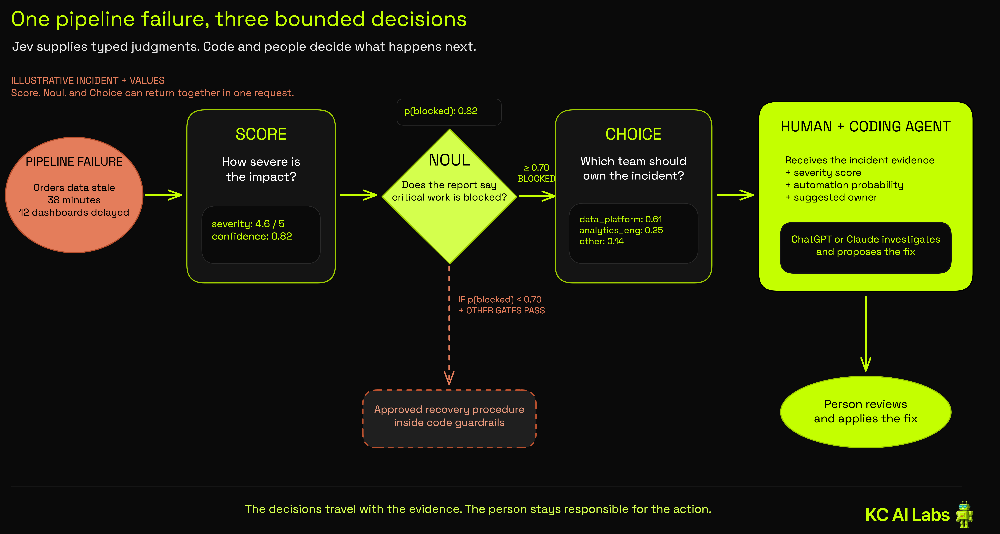

# TypeSafe Jev Incident Router

> **Start here:** [TypeSafe Jev use cases for data teams](./docs/data-team-use-cases.md)

This demonstration repository's main value is the TypeSafe Jev use-case guide, which covers practical ideas across data engineering, analytics engineering, data analytics, and data science. The runnable Python example shows how one of those ideas fits inside an operational workflow by routing synthetic data incidents while keeping exact facts, model judgments, application policy, and human review separate.

The project uses all three TypeSafe answer types:

- `Choice` suggests a response team from a fixed list.
- `Score` places business impact on an ordered rubric.
- `Noul` estimates whether the incident report says critical work is blocked.

The model supplies bounded judgments and their uncertainty. Python decides what those judgments are allowed to do.

## Decision flow

The opening example follows one business-critical pipeline failure through all three TypeSafe answer types, then carries the typed decisions and original evidence into a human-led coding workflow.



The selection rule is intentionally simple:

1. Use deterministic code when the input and rule are exact.
2. Use Jev when the input is messy, the acceptable answers are bounded, and uncertainty should affect the next code path.
3. Use a generative model when the output itself is the artifact, such as an explanation, analysis, query, or code.
4. Use human review when the consequence is high or the measured uncertainty crosses a tested threshold.

These are selection heuristics, not capability boundaries. Generative models can return structured output, and Jev can be one component inside a larger system that also uses ChatGPT, Claude, or another model.

## Why the registry comes first

The sample registry maps known assets to response teams. When the incident names an asset with an authoritative owner, the router uses that fact and does not ask Jev to infer ownership. Jev still evaluates impact and whether critical work is blocked.

When the registry has no match, Jev receives the synthetic incident and answers three focused questions. The application then applies named policy constants from [`tools/questions.py`](./tools/questions.py):

- Choice confidence below `0.75` enters review.
- Score confidence below `0.70` enters review.
- A Noul probability of `0.70` or higher for blocked critical work forces high-priority review.
- An impact score of `2.0` or higher sets high priority.

These thresholds are illustrative. A production team should choose them from labeled cases that reflect its own costs, review capacity, and tolerance for mistakes.

## Prerequisites

- Python 3.11 or newer
- [`uv`](https://docs.astral.sh/uv/)
- A TypeSafe API key only when using `--live`

Install the pinned environment:

```bash
uv sync
```

Run the offline test suite:

```bash
uv run pytest -q
```

## Run the fixture examples

Fixtures keep the workflow deterministic and do not call TypeSafe.

Automatic semantic route:

```bash
uv run python -m scripts.route_incident \
  --incident data/incidents/semantic_route.json \
  --fixture automatic
```

Low-confidence review route:

```bash
uv run python -m scripts.route_incident \
  --incident data/incidents/ambiguous_owner.json \
  --fixture low_confidence
```

The low-confidence fixture selects `data_platform` while returning Choice confidence `0.39`. The router keeps the suggestion and writes a review decision instead of assigning the incident automatically. The fixture is a policy example and must not be presented as a fresh model response.

Other fixture names exercise specific paths:

```text
unknown_owner  confident other_or_unknown selection
critical_risk  blocked critical work forces high-priority review
weak_impact    uncertain impact score enters review
api_error      service failure enters the durable review queue
```

Review decisions are written to `.local/review_queue.jsonl` by default. The queue suppresses duplicate entries using the incident reference.

## Make a live request

Set your key, either in the current shell:

```bash
export TYPESAFE_API_KEY="your-key"
```

or in a local `.env` file at the project root (gitignored, loaded automatically):

```text
TYPESAFE_API_KEY=your-key
```

A shell-exported value takes precedence over `.env` if both are set. Run the same policy with the current TypeSafe model alias:

```bash
uv run python -m scripts.route_incident \
  --incident data/incidents/ambiguous_owner.json \
  --live
```

The command prints the concrete model version returned by the service. It does not assume that a live choice or probability will match any fixture.

## Evaluate policy outcomes

The calibration worksheet demonstrates the metrics a team can track after labeling representative outcomes:

```bash
uv run python -m scripts.evaluate_calibration data/calibration_cases.jsonl
```

It reports:

- misroute rate, using automatic assignments as the denominator;
- review rate, using all labeled cases as the denominator;
- mean minutes to the correct responder, using all labeled cases as the denominator.

The included rows are synthetic examples. Their metric values do not measure Jev's accuracy or production performance.

## Data and privacy boundary

Every tracked incident is synthetic. Before sending real incident text to an external service, confirm your organization's vendor approval, retention, residency, access, and redaction requirements. Avoid placing credentials, personal data, customer data, or operational identifiers in tracked fixtures or logs.

## Project structure

```text
data/
  calibration_cases.jsonl    labeled synthetic outcomes
  fixtures/                  deterministic Jev-shaped responses
  incidents/                 synthetic incident inputs
  response_teams.json        authoritative asset-to-team registry
images/
  incident-decision-flow.excalidraw  editable incident example source
  incident-decision-flow.png         rendered incident example
docs/
  data-team-use-cases.md      cross-disciplinary Jev use-case guide
  incident-routing-flow.md    implementation decision flow
  plans/                      design and implementation notes
scripts/
  evaluate_calibration.py    calibration worksheet
  route_incident.py          command-line entry point
tools/
  clients.py                 live and fixture adapters
  models.py                  application-owned data structures
  policy.py                  pure routing policy
  questions.py               TypeSafe questions and policy constants
  registry.py                exact ownership lookup
  review_queue.py            idempotent JSONL persistence
tests/                       offline behavior tests
```

## References

- [Data-team use cases for Jev](./docs/data-team-use-cases.md)
- [Introducing System One Models and Jev](https://typesafe.ai/blog/introducing-system-one-models-and-jev)
- [TypeSafe workflow evaluations](https://evals.typesafe.ai/)
- [Jev is the fastest-adopted model in AI Gateway history](https://vercel.com/blog/ai-gateway-jev-model-launch)
- [TypeSafe quick start](https://docs.typesafe.ai/introduction/quickstart)
- [Primitives](https://docs.typesafe.ai/primitives)
- [Confidence](https://docs.typesafe.ai/confidence)
- [Example use cases](https://docs.typesafe.ai/concepts/use-case-map)
