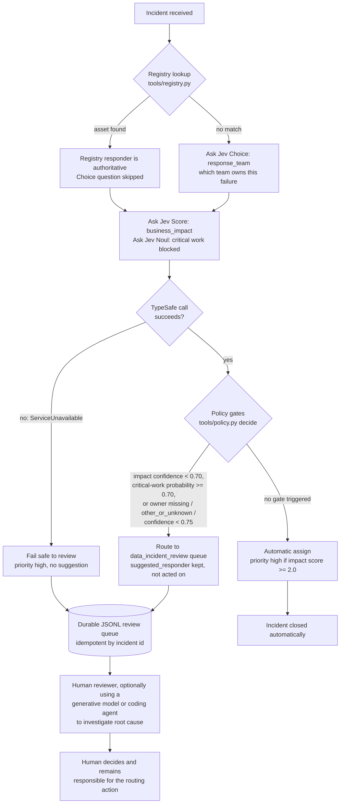

# Incident routing flow

This diagram traces one incident through the implementation in [`tools/registry.py`](../tools/registry.py), [`tools/questions.py`](../tools/questions.py), [`tools/clients.py`](../tools/clients.py), and [`tools/policy.py`](../tools/policy.py), as run by [`scripts/route_incident.py`](../scripts/route_incident.py). Thresholds shown are the named constants in `tools/questions.py`; no live judgment values are included here, since those vary per run and per incident.

## Reading the branches

- **Registry first.** [`tools/registry.py`](../tools/registry.py) checks the exact asset-to-team map in [`data/response_teams.json`](../data/response_teams.json) before any model call. A match means Jev never has to guess ownership; it still evaluates impact and whether critical work is blocked.
- **Jev's three judgments.** Built in [`tools/questions.py`](../tools/questions.py): a `Choice` for the response team (only asked when the registry has no match), a `Score` for business impact, and a `Noul` for whether the report itself states critical work is blocked.
- **Confidence and risk gates.** [`tools/policy.py`](../tools/policy.py) applies four named thresholds: `IMPACT_CONFIDENCE_FLOOR` (0.70), `CRITICAL_WORK_REVIEW` (0.70), `OWNER_CONFIDENCE_FLOOR` (0.75), and `HIGH_IMPACT_SCORE` (2.0). Any confidence or risk gate failing sends the incident to review instead of assigning it automatically; the model's suggested responder is preserved either way, since it stays useful context for the reviewer.
- **API failures fail safe.** A `ServiceUnavailable` exception, raised by [`tools/clients.py`](../tools/clients.py) around any TypeSafe transport error, routes straight to the same review queue at high priority, without a suggested responder.
- **Durable review queue.** [`tools/review_queue.py`](../tools/review_queue.py) persists review decisions to JSONL, deduplicated by incident reference, so a review decision is never silently lost or double-queued.
- **Human-led investigation.** Once an incident reaches review, a person can hand it (and Jev's bounded judgment) to a generative model or coding agent to investigate faster. That step produces an explanation or analysis, not a routing decision, and the person stays responsible for what happens next.
